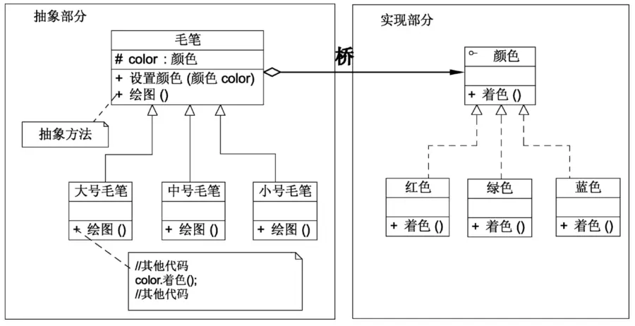
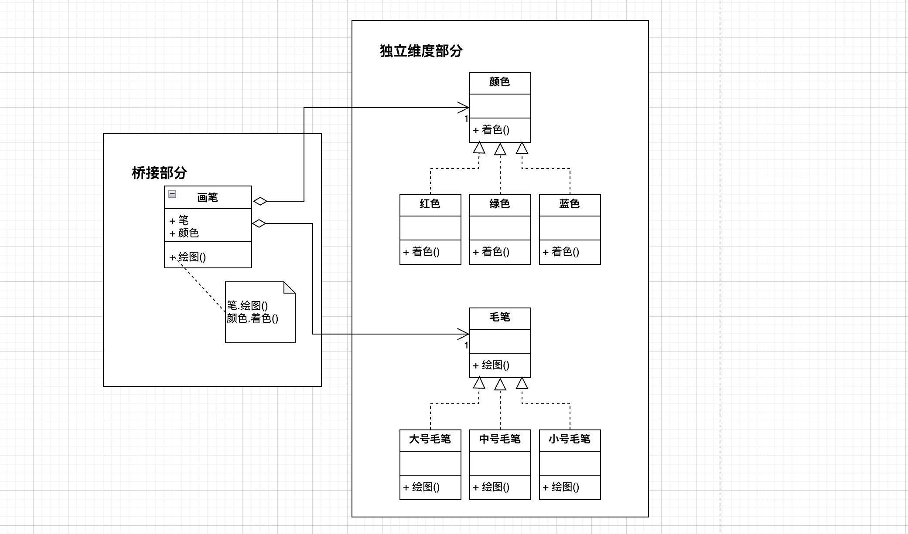

## 传统定义

桥接模式一般的定义描述是“将抽象部分与其实现部分分离，使它们都可以独立地变化”。

这定义看着有些懵逼，什么叫抽象与实现分离？抽象和实现本来不就应该是分离的吗？抽象父类、接口定义是抽象，具体子类、接口实现是实现，这些本来就应该是分离的吧？

《设计模式的艺术》10.2节《桥接模式概述》里提到，“如果软件系统中某个类存在两个独立变化的维度，通过该模式可以将这两个维度分离出来，使两者可以独立扩展”、“与多层继承方案不同，它将两个独立变化的维度设计为两个独立的继承等级结构，并且在抽象层建立一个抽象关联，该关联关系类似一条连接两个独立继承结构的桥，故名桥接模式”。

看了这里的概述，才算对桥接模式有些明白了。这里无疑是对桥接模式更好的定义描述，不知《设计模式的艺术》作者为何不从这里提取出更合适的定义，而采用了所谓经典书里或网上的普遍描述。

桥接模式的传统定义明显是有问题的，为什么不改正它？

不仅定义让人难理解，而且按照描述去设计代码，也是有问题的，比如《设计模式的艺术》书中的“`图10-4 毛笔结构示意图`”

图里，抽象部分既负责尺寸维度的实现（这个本该和颜色维度一样是独立的），又负责关联组合颜色维度，这明显违背了单一职责原则。

将抽象部分里除了桥接部分的职责抽离到单独的实现里，如下图，这样就好看多了。

### 新定义

下面给出笔者所想的定义：

桥接模式：将一个类中可以独立变化的实现抽离出来，抽象部分仅保留将各个独立的实现桥接起来的职责。
